# 毕设中期汇报，HTML，制作要求。  
  
# 目前就是我要根据这个我的一个产，这个毕设，模块化的一个露营厨房产品，然后制作一个那种汇报的 HTML，然后它有一些交互功能。我说一，大概说一下我目前的设想，就是我文案已经定好了，就是每一页去讲什么东西。然后我说说我大概想法，就是每一页去放什么。就首先第一页，就这个 HTML 禁止那种文字很大，然后所有的图片只是一一个小方块的这样子的一个。样式。然后我建议整体的大概的这个 PPT 的风格，就是类似我现在发给你的。就是。有大图的话，一定要尽量铺满。然后背景可以和大图的整个颜色是融为一体的，就是大图要铺满。然后文字是事实上是在图上，不要就是图片都是小方框，然后有一个什么奇怪的颜色背景，然后旁边是文字，那样整体是非常 low 的。  
# [每一页文案。.md](Attachments/A79AFDA2-28F0-4C4A-AFDE-0990070169D9.md)  
  
[模块化露营(6).pdf](Attachments/25A0BB31-675C-4F89-90D1-C212A75F8030.pdf)  
# 然后第一页我的设想就是，背景就是那种白色极简，然后它上面有第一页的一个文案，然后这一页主要是这个展开图放到最大的位置上，然后比如说在右边，右下角可以放一个这个比较缩小的。放一个比较小的，就它收成一个行李箱的这个样子。  
  
# 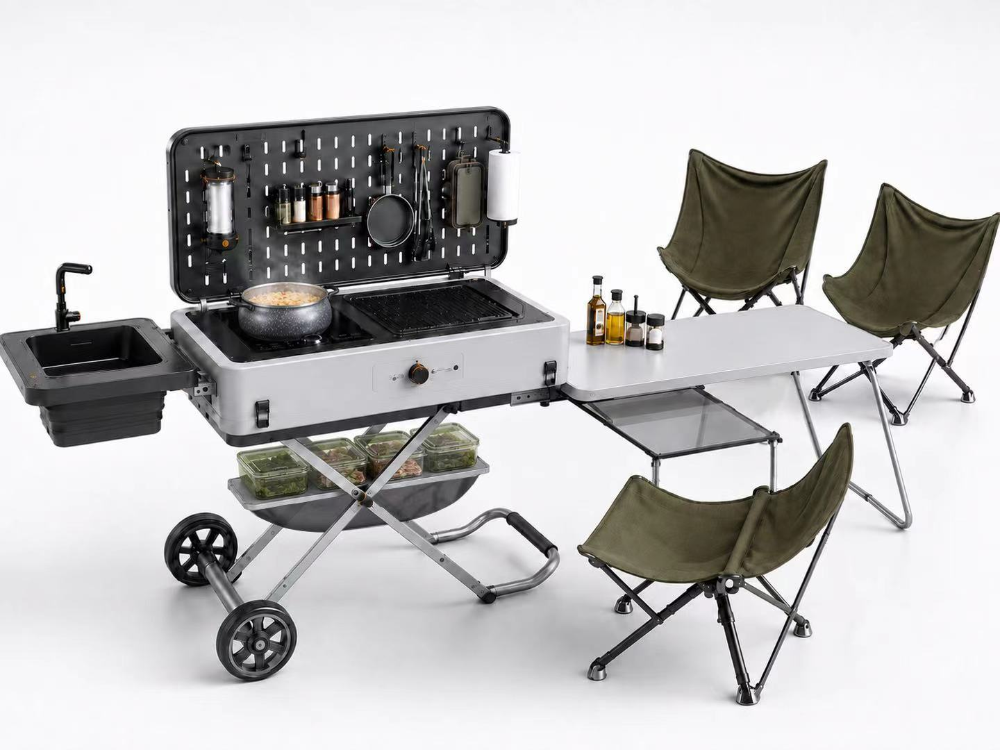  
# 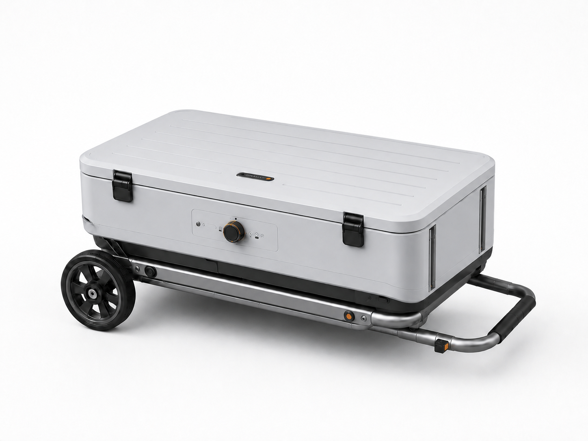  
# 就主要营造出来，它的两种状态的一个强烈视觉对比就行了。然后第二页是上不需要变内容，就是第一页的文字内容消失，文字消失。然后上面可以就是有颜色变深的那种，透明玻，那个，毛玻璃，然后上面写，把设计背景的内容写上去。  
  
然后第三页可以就是，以一个就是，流程图的一个形式，大概说明。就每个是黑色的最大文字，其实是在最主要，比如说都在左上角，然后这个底下文字这些步骤，然后可以使使用流程图的方式，然后每一个步骤你可以配就是相应的就那个图片那种线条式的那种 icon 就展现 这个步骤是什么？然后底下辅以文字，怎样好看怎样来。  
  
然后到第四的时候，事实上可以给出每个这种景，这个可以给出一个具体的一个产品的例子，然后我把图给你了。这一页事实上就是排除这四个图。结合文案和产品名，比如产品名在图的底下，文案在上面。  
****模块桌解决现场台面****
Snow Peak IGT Camp Kitchen  
**收纳箱解决出发前装载**
YETI LoadOut GoBox 30  
**炉具解决烹饪**
Jetboil Genesis Basecamp System  
**推车解决搬运**
Mac Sports Push & Pull Wagon  
  
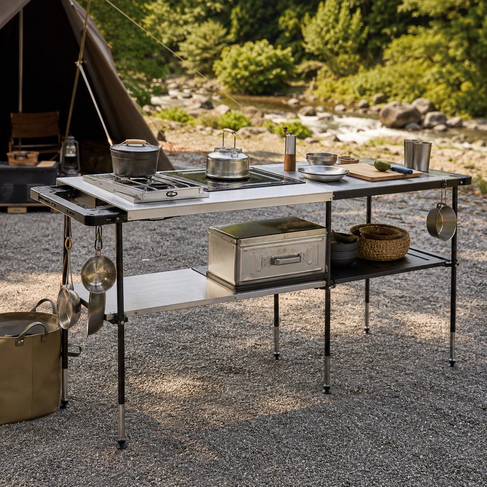  
  
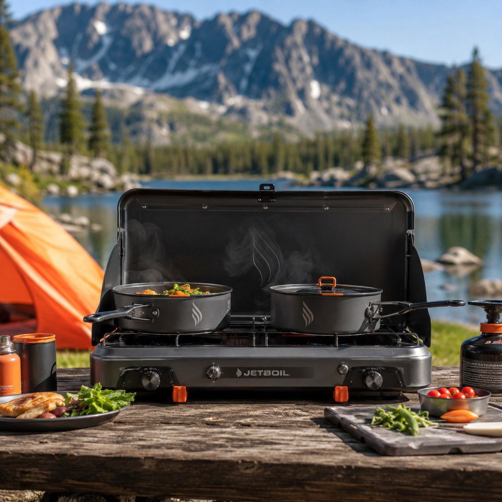  
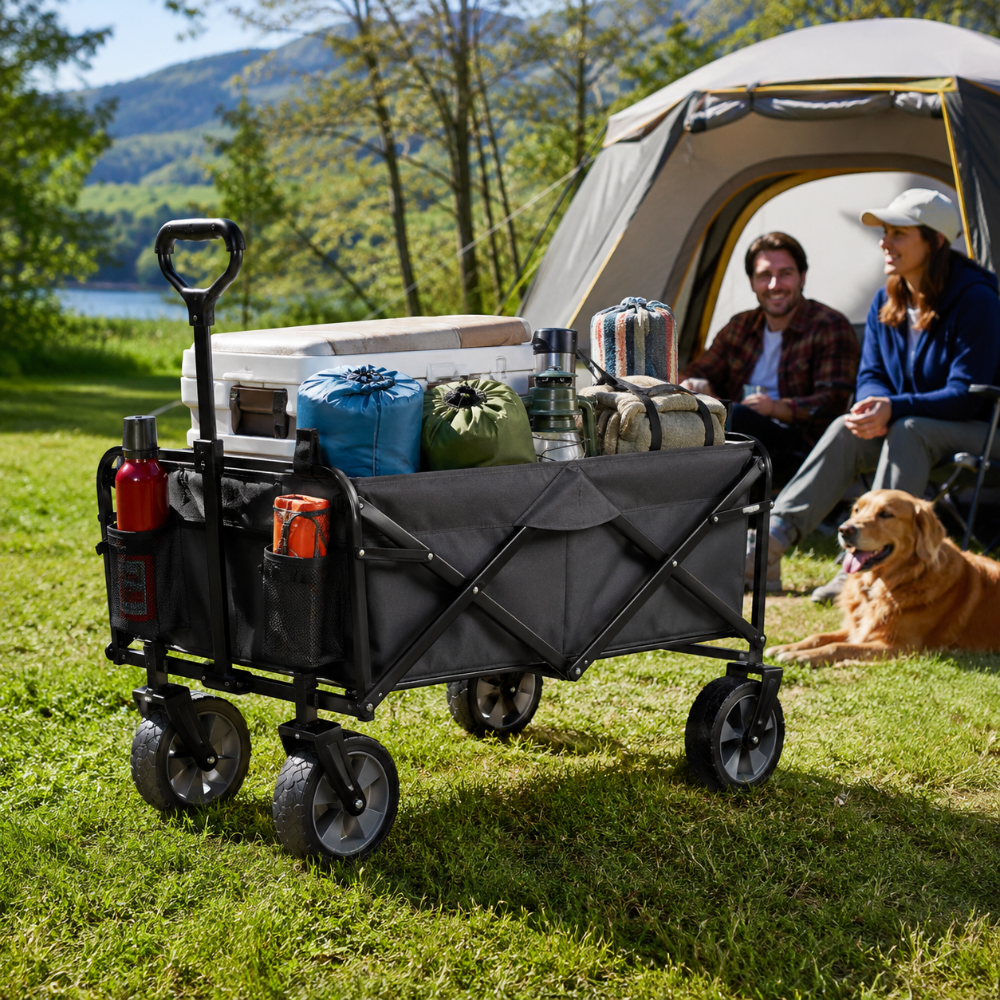  
然后第五就是创意构思。这里头如果纯文字可能有点单调，你可以以你的。对，就是这种简约时尚感，PP，那个 HTML 的。汇报的理解，加一些适当的一个。配图或者一些小的一些小 icon 什么的，在他们每个点前面。  
  
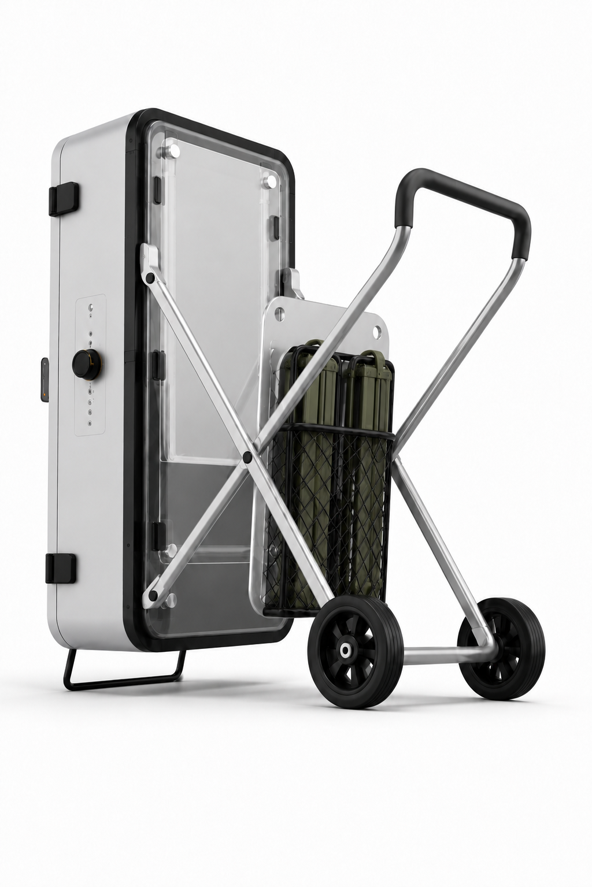  
  
然后第六页主要可以就是一个那种流程图的形式，流程的形式。把这三个内容从左到右，就是给人看它是怎样的一个开合状态。  
  
  
这两张图是指的是右侧桌板可以上下变化。第七页里头的。  
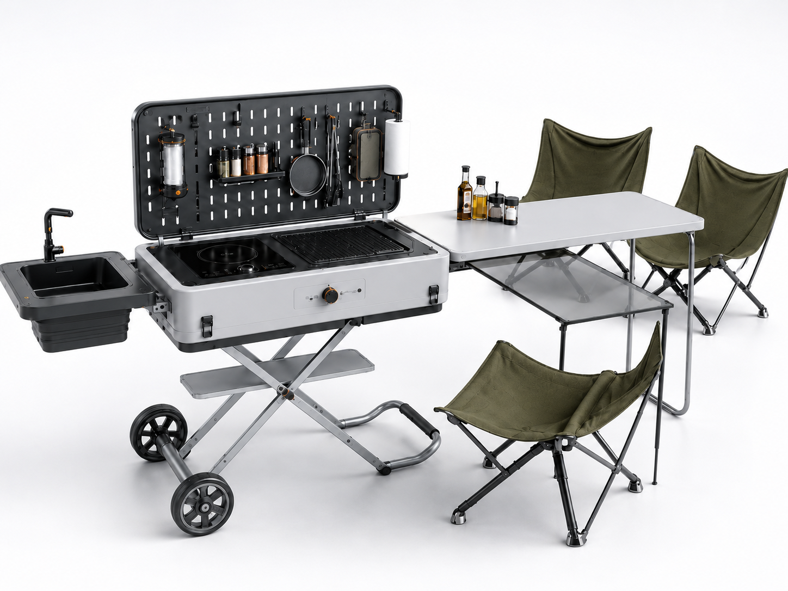  
  
  
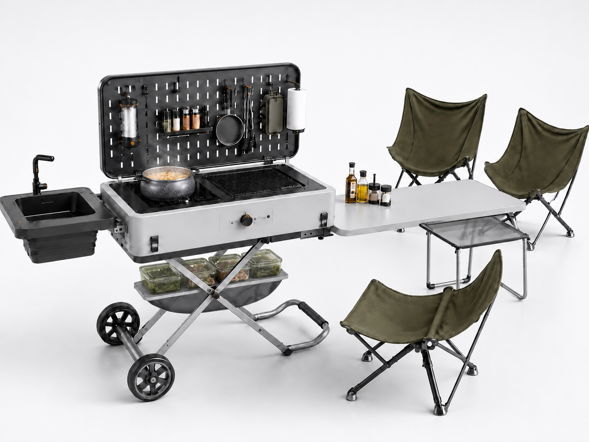  
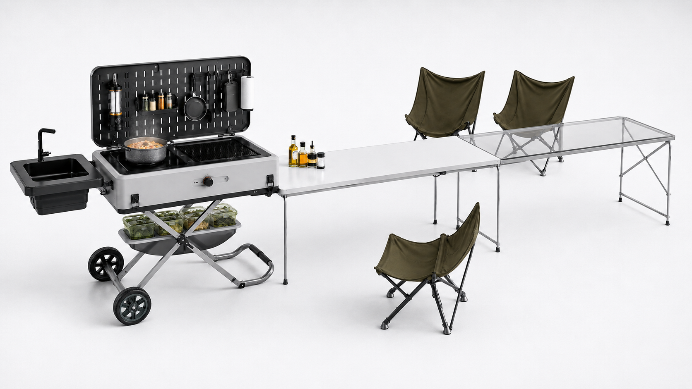  
然后第七页，不是第七页，就是第七页。你可以根据内容，然后看一下怎么设计。比如说底下有一些那种可以让我点击切换的一些小按钮，然后一点就实时的就是切换这几个东西的一个状态。你可以根据文文字描述，看看怎么安排，好看。反正就是让我可以有一些就是交互。的，因为很多同学做 PPT 其实就一页一页，所以我我是想加入一些交互，就是让整个这个非常惊艳别人，很有意思。就可以可以有一些人和这个 p HTML 交互的一些点。  
  
  
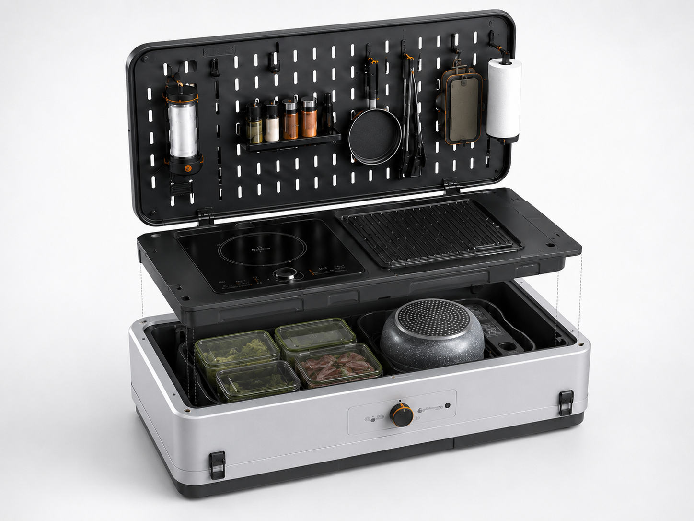  
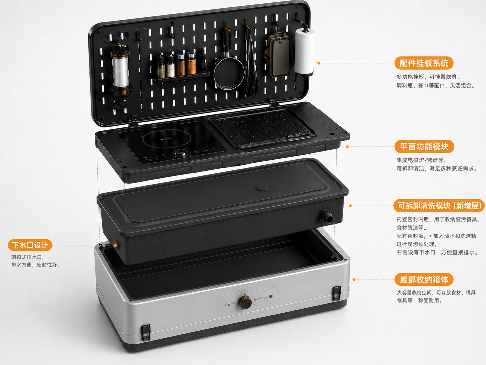  
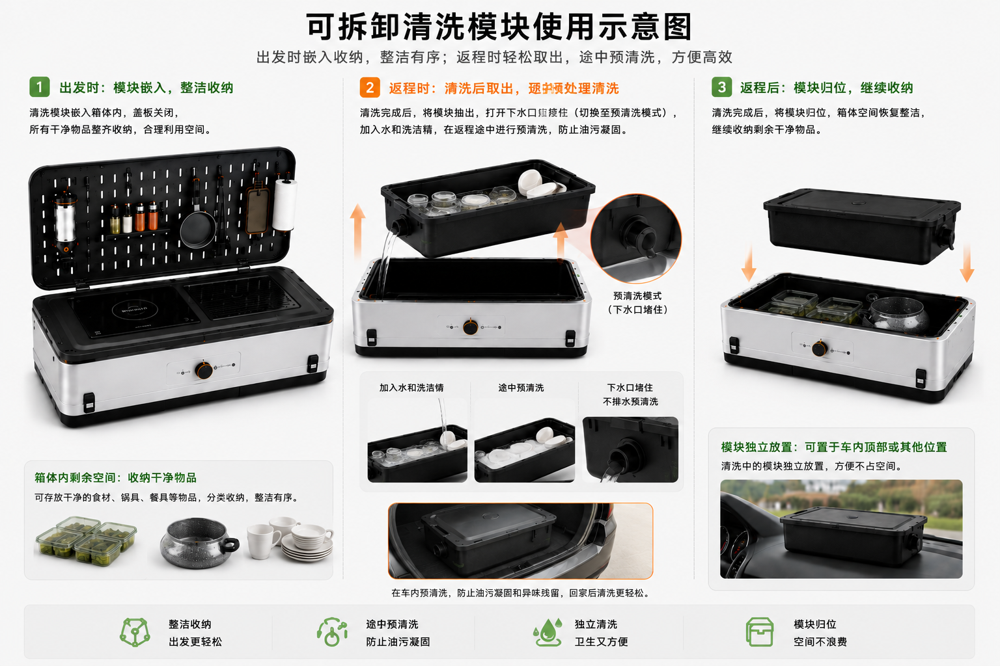  
然后关于第9页的内容，不是，呸，第8页的内容。这些图其实应该就是你要分开截取，因为有一些内容放到一起了。就比如说现在放到 PPT 上就不能，只把这三张图怎么排一下，而是你根据 PPT 的内容，只截取一些图，然后帮我重新排一下内容。根据我的文案，看一下怎么排合适。然后示示意清楚即可。不要直接把这三个图就往里一放，别人是看不懂的。里面内容你可以截取。  
  
然后最后一页的内容是上，你就上面加一个，就那种毛玻璃。然后把最后的这个话一说就好了。  
  
  
然后 PPT 的字体可以使用苹方  
  
  
  
  
